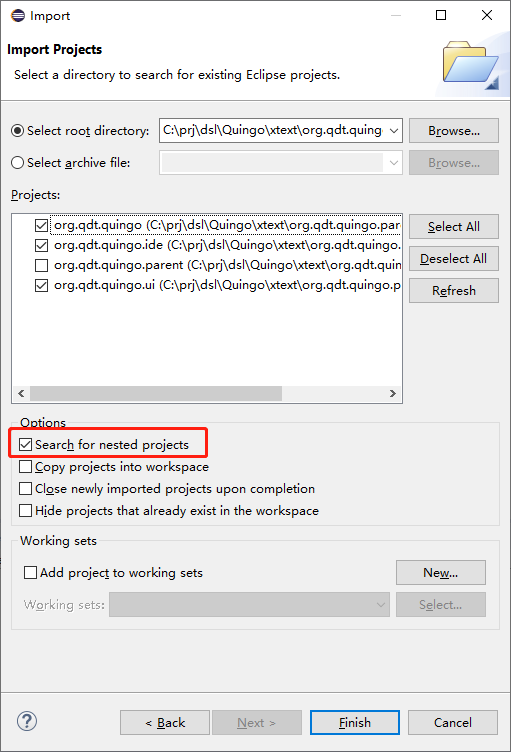

# Build the Xtext Project for Quingo
This file introduces the processes to run the Xtext project for Quingo on your computer:
- [Software Installation](#software-installation)
	+ [*JDK* installation & configuration](#jdk)
	+ [*Xtext* installation](#xtext-installation)
	+ [Maven installation](#maven-installation)
- [Source Code Import](#source-code-import)
- [Project Building](#project-building)
	+ [Eclipse plug-in](#eclipse-plug-in)
	+ [Standalone compiler](#standalone-compiler)
	+ [Language server](#language-server)
- [Known Issure](#known-issue)

## Software Installation

### JDK installation & configuration

JDK is required to support the execution of Eclipse. If your Eclipse can run well, then you can skip this step.

First, download the latest version of the JDK8 from the [official website](https://www.oracle.com/java/technologies/javase/javase-jdk8-downloads.html). Run the installation package and click *Next* in the installation wizard until the installation completes.

After installing the JDK, you need to configure environment variables. The following variables with corresponding value should be added in the system variables:
- **variable name**: `JAVA_HOME`, **value**: `<Path to Install JDK>`
- **variable name**: `CLASSPATH`: **value**: `.;%JAVA_HOME%\lib;%JAVA_HOME%\lib\tools.jar`
<!-- - Append the string `%JAVA_HOME%\bin;%JAVA_HOME%\jre bin;` -->

You can use environment-variable editors such as *RapidEE* to add/modify these variables, or modify it mannually in Windows by right-clicking  *My Computer* -> *Properties tab* -> *Advanced System Settings* and enter *Environment Variables*.

<!-- - *System Variables* - > *New Variables* (Variable Name: JAVA_HOME, Variable Value: Path to Install JDK)
- *System Variables* - > *New Variables* (Variable Name: CLASSPATH, Variable Value: **.;%JAVA_HOME%\lib;%JAVA_HOME%\lib\tools.jar**)
- *System Variables* - > *Select Path* - > *Edit*, input **" % JAVA_HOME% bin;% JAVA_HOME% jre bin; "**
- Type *java-version* into the **cmd** to verify that the configuration was successful -->

### Xtext installation
1. Download the latest version of Eclipse from the [official website](https://www.eclipse.org/downloads/). The version we used for developing is 2019-12 (4.14.0).
2. Run the installation package.
3. Select **Eclipse DSL Tools** in the installation wizard, and click **INSTALL** to complete the installation process.
Xtext is contained in the installed DSL tools.
4. Install the Xsemantics plugin. Click the *Help->Install New Software...* manual in Eclipse. In the poped up window, fill  https://dl.bintray.com/lorenzobettini/xsemantics/updates in the *Work with* field. Press *Enter* and wait for a few seconds. Multiple versions of Xsemantics will be shown. Select the latest one and press *Next*. See *xsemantics_intro.pptx* for screenshots.

### Maven installation
Maven is used to generate the language server for VS Code extension. If you do not intend to generate it, you can skip this process.

You can install it following [https://maven.apache.org/install.html](https://maven.apache.org/install.html).

## Source Code Import
1. Open the installed Eclipse, set a folder as the Workspace, and click Launch. Avoid having spaces (" ") in the Workspace path.
2. Click *File* -> *Import* -> *General* -> *Existing Projects into Workspace* and click *Next*. In the pop-up dialog, click "*Browse...*". Select the *xtext\org.qdt.quingo.parent* folder in this repository. Next, check the *Search for nested projects* option, and you can find five items in the *project:* field. Select all the projects except the one having *.parent* suffix and click *Finish*.

 
## Project Building
Three types of targets can be built from this project, i.e., an Eclipse plugin, a standalone compiler, and a language server. 

### Eclipse plug-in
This is the default target of this Eclipse project. After you save the source code, an Eclipse plug-in will be built automatically in an incremental way. You can rebuild the whole plug-in by calling `Project -> Clean` from the menu.

The plug-in can be invoked by right clicking org.qdt.quingo package in Package Exploer and select **Run As** -> **Eclipse Application**. In the new window, click *File* -> *Import* -> *General* -> *Existing Projects into Workspace* and click *Next*. In the pop-up dialog, click "*Browse...*". Select the *xtext* folder. Next, in the *project:* field, select only *quingo.source* and click *Finish*. This import process needs to be done for only once.

### Standalone compiler
The standalone compiler is an executable jar file. It can be generated following these steps:
1. Right click the `Main.java` under org.pcl.qingo.generator package in Package Explorer. Select **Run As** -> **Java Application**.
2. Right click the `Main.java` under org.pcl.qingo.generator package in Package Explorer. Click "Export".
3. Select `Java -> Runnable JAR file` and click "next."
4. Select a suitable destination. Select the second item (Package required libraries into generated JAR) in "Library handling." Click finish.

### Language server
The language server can be used in other software such as VS Code. It can be generated with a Maven project.
1. Open a terminal (e.g., PowerShell on Windows) and enter xtext/org.qdt.quingo.parent directory.
2. Run `mvn package` command.
3. After a few minutes, the language server will be built under xtext/org.qdt.quingo.parent/org.qdt.quingo.ide/target/languageserver directory. If it is the first time you build, Maven needs to download many dependent repositories. This process may take several hours, depending on your network condition. You may encouter time-out and connection errors, so you have to repeat this process several times. Good luck!

## Known Issue
When generating Xtext artifacts, the following message may show up:
> \* ATTENTION *
 It is highly recommended to use ANTLR's parser generator (get it from http://xtext.itemis.com/)
 As an alternative to ANTLR you could also use the alternative implementation shipped with Xtext.
 To do so use the generator fragment org.eclipse.xtext.generator.parser.packrat.PackratParserFragment in your mwe2 file instead. Element: -UNKNOWN-; Reported by XtextGenerator

It can be solved by installing Xtext Antlr Runtime Feature in a similar way as Xsemantics. Click "Help -> Install new software...". In the pop-up window, copy "http://download.itemis.de/updates/releases" to the "Work with:" field and press Enter. Eclipse will fetch avalible softwares from that link, which may take several minutes. When it is done, select "Xtext Antlr -> Xtext Antlr Runtime Feature" in the software list. Then, press "Next" and finish the installing.